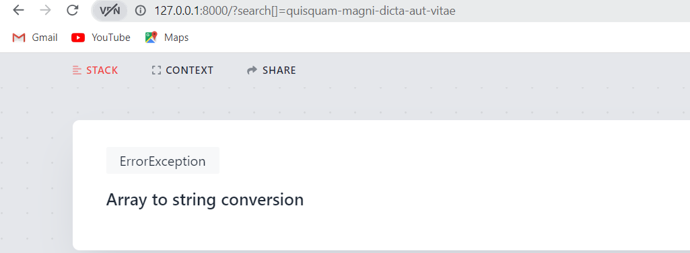

## Laravel Security Tips

### Deploy App & App Environment
- Remember to set the **APP_ENV=production** and **APP_DEBUG=false** in .env file 
- If it's set to **APP_ENV=local** and **APP_DEBUG=true**
  - Errors will appear to user 
  - then he can make a source dive in your project
  - and get cookie of user and login to your application
  - if you have packages like telescope it will be accessible to all users

### Missing Authorization

- we must protect route as well as view
  - so we must use Gate or Policy

- Gate: is defined in AuthServiceProvider boot method 

- Policy: is a separate file connected to controller actions

- We use policy in controller method or controller construct or route

### Validation

Don't depend on request all properties , it may pass an additional field which not in a form but in a fillable prop
but, depend on validation method 

### SQL Injection (sqli)

you must prevent sql injection: which is attack your database query and modify it

by passing parameter to query not but a word in a query directly
or use where not whereRaw

### Escaping (Avoid cross site scripting)
 
- this vulnerability make attackers bass a payload in url and inject JS Code and modify pages
- to prevent it 
    - not to use {!! !!} field because it put the field value as user pass 
    - Instead of it use {{}} 
    - or when you want to but html code use new HtmlString(e($value)); for make html object and escape characters
 

### Markdown Security Concern (Avoid cross site scripting)

- this vulnerability make attackers bass a payload in url and inject JS Code and modify pages
- Attackers may pass js code for example on image methods in markdown 

- To prevent it
    - use escape parameter to convert html in markdown
    - or strip ro remove entire html

      
### Sensitive data

in API and SPA
- use hidden property in Model class, to be not to send in api data
- and use select method in query
- or use resource class 

### Rate Limitation

- It's limit requests in the same time to prevent from DOS attack,
which attackers use scripts to try random (email, password) many times
- To prevent it
  -  limit login attempts to number for example 5 for the same ip make this script take a long time
  -  We can use throttle:api middleware
  

### Type Juggling

- with "==" in php7 and below there is a vulnerable

### The Only Cryptography Secure Random Function
- don't use 
  - md5 of slug value because you can reverse it easily 
    - time() because you can know it from created_at prperty 
    - uniqid() because it's not secure
- but use rand() or random_int() instead (Str::random(40) in laravel)

### Deserialization Attack and solution

don't use serilize
